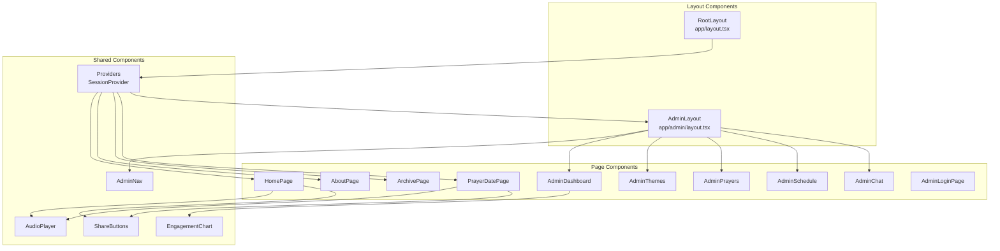
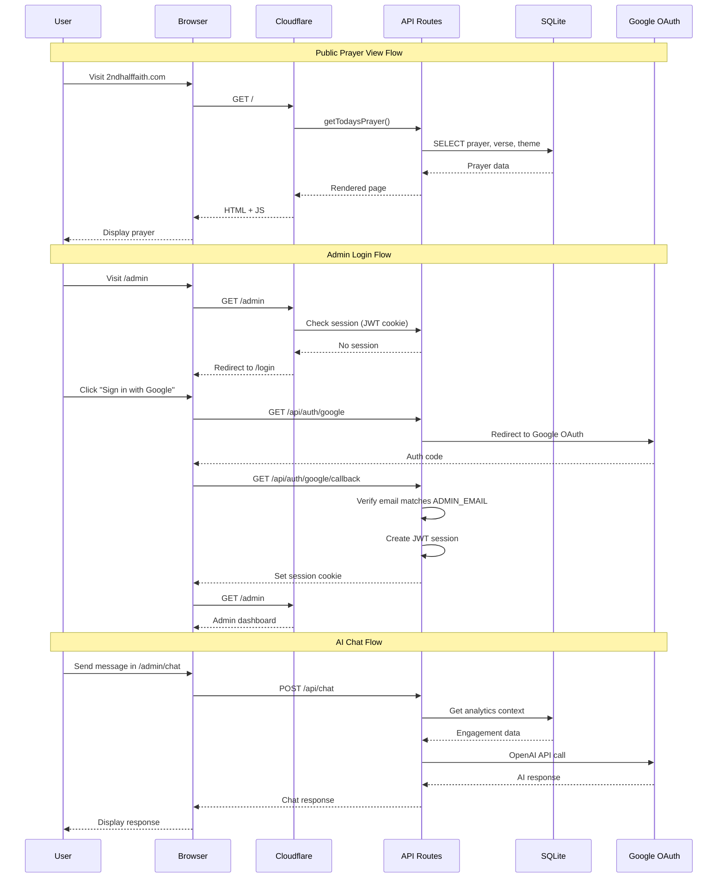
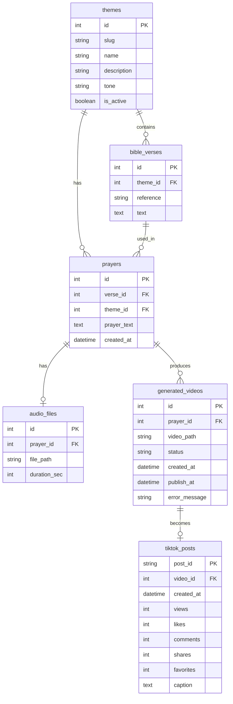
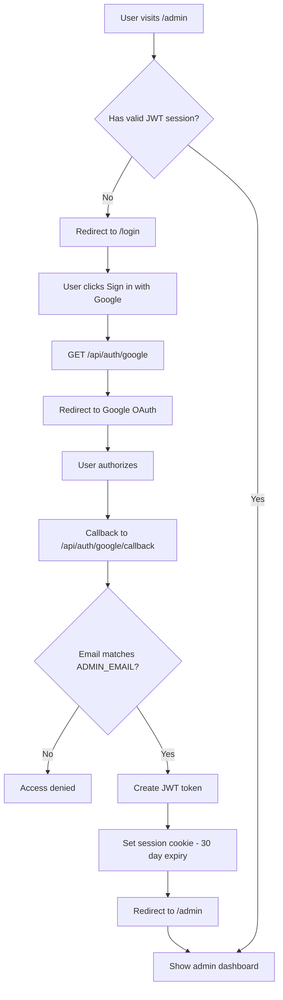

# 2ndhalffaith.com - Architecture Documentation

## Overview

2ndhalffaith.com is a Next.js 15 application that serves daily prayers and devotionals for Christians aged 45+. It includes public-facing pages and a protected admin dashboard for content management and engagement analytics.

## System Architecture

```mermaid
graph TB
    subgraph "Client Layer"
        Browser[Web Browser]
        Mobile[Mobile Browser]
    end

    subgraph "CDN / Edge"
        CF[Cloudflare Pages]
        CFW[Cloudflare Workers]
    end

    subgraph "Application Layer"
        subgraph "Public Pages"
            Home[Home Page<br/>/]
            About[About Page<br/>/about]
            Archive[Prayer Archive<br/>/prayer/archive]
            PrayerDate[Prayer by Date<br/>/prayer/[date]]
        end

        subgraph "Admin Pages"
            Login[Login<br/>/login]
            Dashboard[Dashboard<br/>/admin]
            Themes[Themes Management<br/>/admin/themes]
            Prayers[Prayers Management<br/>/admin/prayers]
            Schedule[Schedule/Queue<br/>/admin/schedule]
            Chat[AI Chat<br/>/admin/chat]
            Tests[Test Dashboard<br/>/admin/tests]
        end

        subgraph "API Routes"
            AuthAPI[Custom OAuth<br/>/api/auth/google/*]
            SessionAPI[Session API<br/>/api/auth/session]
            PrayerAPI[Prayer API<br/>/api/prayer/today]
            AnalyticsAPI[Analytics API<br/>/api/analytics]
            ThemesAPI[Themes API<br/>/api/themes]
            PrayersAPI[Prayers API<br/>/api/prayers]
            QueueAPI[Queue API<br/>/api/queue]
            ChatAPI[Chat API<br/>/api/chat]
            AudioAPI[Audio API<br/>/api/audio/[id]]
            TestsAPI[Tests API<br/>/api/tests]
        end
    end

    subgraph "External Services"
        Google[Google OAuth]
        OpenAI[OpenAI API]
    end

    subgraph "Data Layer"
        SQLite[(SQLite Database<br/>social.db)]
        AudioFiles[Audio Files<br/>/data/audio/]
    end

    Browser --> CF
    Mobile --> CF
    CF --> CFW
    CFW --> Home
    CFW --> About
    CFW --> Archive
    CFW --> PrayerDate
    CFW --> AdminLogin
    CFW --> Dashboard
    CFW --> Themes
    CFW --> Prayers
    CFW --> Schedule
    CFW --> Chat

    Home --> PrayerAPI
    PrayerDate --> PrayerAPI
    Archive --> PrayersAPI
    Dashboard --> AnalyticsAPI
    Themes --> ThemesAPI
    Prayers --> PrayersAPI
    Schedule --> QueueAPI
    Chat --> ChatAPI

    AdminLogin --> AuthAPI
    AuthAPI --> Google
    ChatAPI --> OpenAI

    PrayerAPI --> SQLite
    AnalyticsAPI --> SQLite
    ThemesAPI --> SQLite
    PrayersAPI --> SQLite
    QueueAPI --> SQLite
    AudioAPI --> SQLite
    AudioAPI --> AudioFiles
```

## Component Architecture



## Data Flow



## Database Schema



## Directory Structure

```
website/
├── app/                          # Next.js App Router
│   ├── layout.tsx               # Root layout with Providers
│   ├── page.tsx                 # Home page (today's prayer)
│   ├── globals.css              # Global styles
│   ├── about/
│   │   └── page.tsx             # About page
│   ├── prayer/
│   │   ├── archive/
│   │   │   └── page.tsx         # Prayer archive listing
│   │   └── [date]/
│   │       └── page.tsx         # Prayer by date
│   ├── login/
│   │   └── page.tsx             # Login page (outside admin layout)
│   ├── admin/
│   │   ├── layout.tsx           # Admin layout with auth check
│   │   ├── page.tsx             # Dashboard
│   │   ├── themes/
│   │   │   └── page.tsx         # Themes management
│   │   ├── prayers/
│   │   │   └── page.tsx         # Prayers management
│   │   ├── schedule/
│   │   │   └── page.tsx         # Queue/schedule view
│   │   ├── chat/
│   │   │   └── page.tsx         # AI chat assistant
│   │   └── tests/
│   │       └── page.tsx         # Test status dashboard
│   └── api/
│       ├── auth/
│       │   ├── google/
│       │   │   └── route.ts     # Initiate Google OAuth
│       │   ├── google/callback/
│       │   │   └── route.ts     # Handle OAuth callback
│       │   ├── logout/
│       │   │   └── route.ts     # Clear session
│       │   └── session/
│       │       └── route.ts     # Get current session
│       ├── prayer/today/
│       │   └── route.ts         # Today's prayer API
│       ├── analytics/
│       │   └── route.ts         # Engagement analytics
│       ├── themes/
│       │   └── route.ts         # Themes CRUD
│       ├── prayers/
│       │   └── route.ts         # Prayers CRUD
│       ├── queue/
│       │   └── route.ts         # Video queue status
│       ├── chat/
│       │   └── route.ts         # AI chat endpoint
│       ├── tests/
│       │   └── route.ts         # Test run history
│       └── audio/[id]/
│           └── route.ts         # Audio file streaming
├── components/
│   ├── AdminNav.tsx             # Admin navigation
│   ├── AudioPlayer.tsx          # Audio playback component
│   ├── EngagementChart.tsx      # Analytics charts
│   ├── Providers.tsx            # Session provider wrapper
│   └── ShareButtons.tsx         # Social sharing buttons
├── lib/
│   ├── auth.ts                  # Auth utilities
│   ├── session.ts               # JWT session management
│   └── db.ts                    # Database utilities
├── public/
│   ├── 2nd_half_faith_icon_1024x1024.png
│   ├── PRIVACY.md
│   ├── TERMS.md
│   └── tiktok*.txt              # TikTok verification files
├── __tests__/                   # Test files
├── next.config.js
├── tailwind.config.ts
├── tsconfig.json
├── open-next.config.ts          # Cloudflare OpenNext config
├── wrangler.toml                # Cloudflare Workers config
└── package.json
```

## Authentication Flow



Note: We use custom OAuth implementation instead of NextAuth because NextAuth's internal state handling doesn't work on Cloudflare Workers.

## Environment Variables

| Variable | Description | Required |
|----------|-------------|----------|
| `NEXTAUTH_SECRET` | Random string for session encryption | Yes |
| `NEXTAUTH_URL` | Full URL of the site | Yes |
| `GOOGLE_CLIENT_ID` | Google OAuth client ID | Yes |
| `GOOGLE_CLIENT_SECRET` | Google OAuth client secret | Yes |
| `ADMIN_EMAIL` | Email allowed to access admin | Yes |
| `OPENAI_API_KEY` | OpenAI API key for chat | Yes |
| `DB_PATH` | Path to SQLite database | No (defaults to ../data/social.db) |
| `DATA_DIR` | Path to data directory | No (defaults to ../data) |

## Technology Stack

- **Framework**: Next.js 15 (App Router)
- **Hosting**: Cloudflare Pages + Workers (via OpenNext)
- **Database**: SQLite (via sql.js)
- **Authentication**: Custom Google OAuth with JWT sessions (jose library)
- **AI**: OpenAI GPT-4 Turbo
- **Styling**: Tailwind CSS
- **Charts**: Recharts
- **Icons**: Lucide React
- **Testing**: Jest + React Testing Library

## Testing

The website includes a comprehensive testing framework with 146 tests across 5 categories:

| Category | Tests | Schedule |
|----------|-------|----------|
| Auth | OAuth flow, session management | CI |
| API | All endpoint validation | CI |
| Website | Pages, components | CI |
| Data | Freshness, integrity | Daily |
| TikTok | API mocking, publishing flow | Daily |

Run tests:
```bash
npm test                                    # All tests
npm test -- --testPathPattern="__tests__/auth"  # Category
npm test -- --coverage                      # With coverage
```

See [TESTING.md](./TESTING.md) for full documentation.

## Security Considerations

1. **Authentication**: Only `ADMIN_EMAIL` can access admin pages
2. **Session**: JWT tokens signed with `NEXTAUTH_SECRET`, 30-day expiry
3. **API Protection**: All admin APIs check for valid JWT session
4. **OAuth Secrets**: Stored encrypted in Cloudflare environment
5. **Database**: Read-only for public, write for admin only
6. **Custom OAuth**: Built to work on Cloudflare Workers (NextAuth incompatible)
